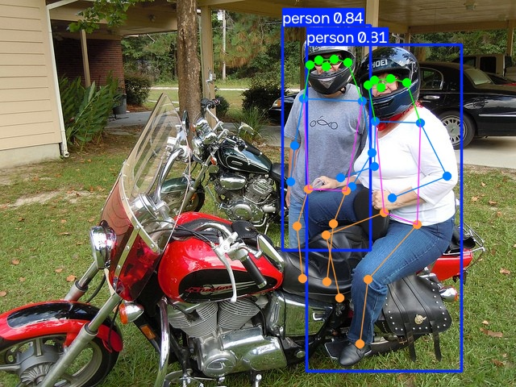
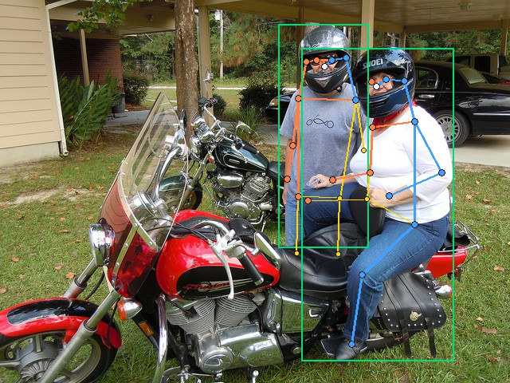

# Báo cáo Ngày 4 - Keypoint & Pose

Họ tên: **Nguyễn Minh Quân** · Mã: **2A202602268**
Ngày: **16/09/2026**

## 1. Nhãn của tôi

| Chỉ số                         |      Giá trị |
| -------------------------------- | -------------: |
| Số ảnh đã gán               |             20 |
| Số skeleton                     |             28 |
| Số keypoint khai báo           | 476 = 28 × 17 |
| v=2 / v=1 / v=0                  |  361 / 88 / 27 |
| Thời gian trung bình mỗi ảnh |       4 phút |

Ba khớp có `%v=1` cao nhất:

1. `left_ear`: 16/28 = 57,14% (bảng công cụ làm tròn 57%).
2. `right_ear`: 13/28 = 46,43% (46%).
3. `left_eye`: 7/28 = 25%; **đồng hạng với `left_wrist`**: 7/28 = 25%.

## 2. Chấm với gold

| Chỉ số                | Bản hiện tại, chưa rework | Sau rework           |
| ----------------------- | ----------------------------: | -------------------- |
| OKS trung bình         |                        0.9161 | Chưa có lần chạy |
| OKS@0.50                |                        0.9655 | Chưa có lần chạy |
| OKS@0.75                |                        0.9655 | Chưa có lần chạy |
| Lỗi`dao_trai_phai`   |                             0 | Chưa có lần chạy |
| Lỗi`nham_nguoi`      |                             2 | Chưa có lần chạy |
| Lỗi`xoa_khop_bi_che` |                             0 | Chưa có lần chạy |

**Lỗi đảo trái/phải:** công cụ chấm gold không phát hiện lỗi đảo trái/phải trong toàn bộ 20 ảnh. Bộ kiểm định dạng vẫn cảnh báo hướng vai/hông so với mắt ở `train_02` và `train_16`. Bốn cảnh báo còn lại liên quan các điểm `v=0` ở `train_04` (hai người), `train_10`, `train_11`; phải đối chiếu mép ảnh và vật che trước khi sửa.

## 3. Kiểm chéo

Bạn cùng nhóm: ______

Khớp lệch `%v=1` nhiều nhất giữa hai bảng đếm:

| Khớp | Bạn | Họ | Lệch | Nguyên nhân (guideline hay gán sai?) |
| ----- | ---: | --: | ----: | --------------------------------------- |
|       |      |     |       |                                         |
|       |      |     |       |                                         |

Luật mới đã bổ sung vào `GUIDELINE_MINI.md` sau khi thống nhất:

<!-- Viết một rule kiểm chứng được: điều kiện nhìn thấy/căn cứ vị trí → chọn v=1 hoặc v=0.
Không chỉ ghi “cẩn thận hơn khi gán”. -->

## 4. Model

Notebook dùng `yolo26n-pose.pt`, train trên 20 ảnh/28 skeleton và đánh giá trên 10 ảnh test/13 skeleton. Cấu hình lưu: `epochs=80`, `imgsz=640`, `batch=8`, `workers=2`, `seed=20260915`, `fliplr=0.5`, `patience=30`. Log ghi dừng sớm ở epoch 41, checkpoint tốt nhất ở epoch 11; thiết bị NVIDIA RTX A1000 Laptop GPU, Ultralytics 8.4.153, Python 3.12.3, torch 2.14.0+cu130.

| Chỉ số       | yolo26n-pose gốc | Sau fine-tune |  Chênh |
| -------------- | ----------------: | ------------: | ------: |
| pose_mAP50     |            0.8450 |        0.8450 | +0.0000 |
| pose_mAP50_95  |            0.6853 |        0.7138 | +0.0285 |
| pose_precision |            0.9734 |        0.9772 | +0.0038 |
| pose_recall    |            0.8462 |        0.8462 | +0.0000 |
| box_mAP50_95   |            0.8051 |        0.8078 | +0.0027 |

### Trả lời năm câu hỏi ở cuối notebook

1. **Thay đổi pose mAP:** `pose_mAP50-95` tăng 0.0285, tức 2,85 điểm phần trăm, từ 0.6853 lên 0.7138. `pose_mAP50` và recall không đổi. Kết quả phù hợp với cải thiện ở các ngưỡng đánh giá nghiêm ngặt hơn; chưa đủ để khẳng định mô hình học được kiến thức mới hay cải thiện tổng quát, vì tập đánh giá nhỏ và được dùng chọn checkpoint. Không có cơ sở để mô tả sự suy giảm khi chỉ số thực tế tăng.
2. **Box so với pose:** tại mAP50-95, chênh lệch box trừ pose là 0.1198 trước fine-tune và 0.0940 sau fine-tune (11,98 và 9,40 điểm phần trăm). Tại mAP50, khoảng cách là 0.1335 ở cả hai lần. Trong phép đánh giá này, tìm vùng người đạt chỉ số cao hơn xác định pose; các khớp khuất hoặc chồng nhau khó định vị. Box dùng IoU còn pose dùng OKS, nên hai con số không phải phép đo hoàn toàn cùng loại.
3. **Ví dụ model sai:** trong `test_09`, người áo trắng bên phải có chân bên khuất được model nối chéo sang vùng chân của người áo xám. Quan sát phù hợp với lỗi **nhầm người** ở chi dưới: đường hông–gối kéo sang cơ thể bên cạnh. Đây là phân loại thị giác, không phải nhãn lỗi do công cụ định lượng sinh ra. Nhãn test để một số khớp khuất bằng v=0 nên không đủ để đo sai số tọa độ của mọi điểm này; cần phân biệt điều đó với lỗi nhìn thấy trên hình.

   

   
4. **Bất đồng lớn nhất trên train:** `train_06` có OKS model so với nhãn thấp nhất, 0.669, theo [bảng xuất từ notebook](../outputs/model_vs_annotations.txt). Người ngồi xe máy có tay và chân phía xa bị che; nhãn dùng v=1 ở khuỷu, cổ tay, hông, gối và cổ chân phải. Nhãn của người gán đạt OKS 0.8852 với gold, cho thấy tương đối sát tham chiếu trên các khớp được gold chấm. Tuy nhiên, không có bảng model-vs-gold trên ảnh này, nên chưa đủ căn cứ khẳng định người hay model đúng ở mọi khớp; 0.669 chỉ đo bất đồng.
5. **Ảnh gán tệ nhất có trùng ảnh model bất đồng nhất không?** Không. Nếu tính cả người thiếu với OKS=0, `train_13` có trung bình trên ba người gold khoảng 0.5909, thấp nhất. Nếu chỉ xét skeleton đã ghép, thấp nhất là người #1 của tôi trong `train_04`, OKS 0.8366; trung bình hai người của ảnh này là 0.8515. Cả hai đều khác `train_06`. Notebook chỉ xếp OKS model-vs-nhãn, không đo thứ hạng lỗi model-vs-gold, nên không thể gọi `train_06` là ảnh model sai nhất so với đáp án. Riêng `train_13`, model tìm 3 người trong khi nhãn chỉ có 2, phù hợp cảnh báo thiếu người từ gold.

## 5. Một rule evidence đã đối chiếu

Ở `train_06`, người #1, `right_wrist` nằm phía xa thân người và bị che khi người lái ngồi trên xe máy. Vai và khuỷu phải cho phép ước lượng đường đi của cẳng tay, trong khi vùng cổ tay dự kiến vẫn ở trong ảnh. Vì vậy nhãn hiện tại giữ tọa độ ước lượng và đặt `v=1`, không dùng `v=0`. `v=0` sẽ loại bỏ một khớp còn trong khung khỏi phần giám sát vị trí, trái với quy tắc lab. Ví dụ này được rà soát từ annotation đã có, không chứng minh chính xác tuyệt đối tọa độ bị che.

